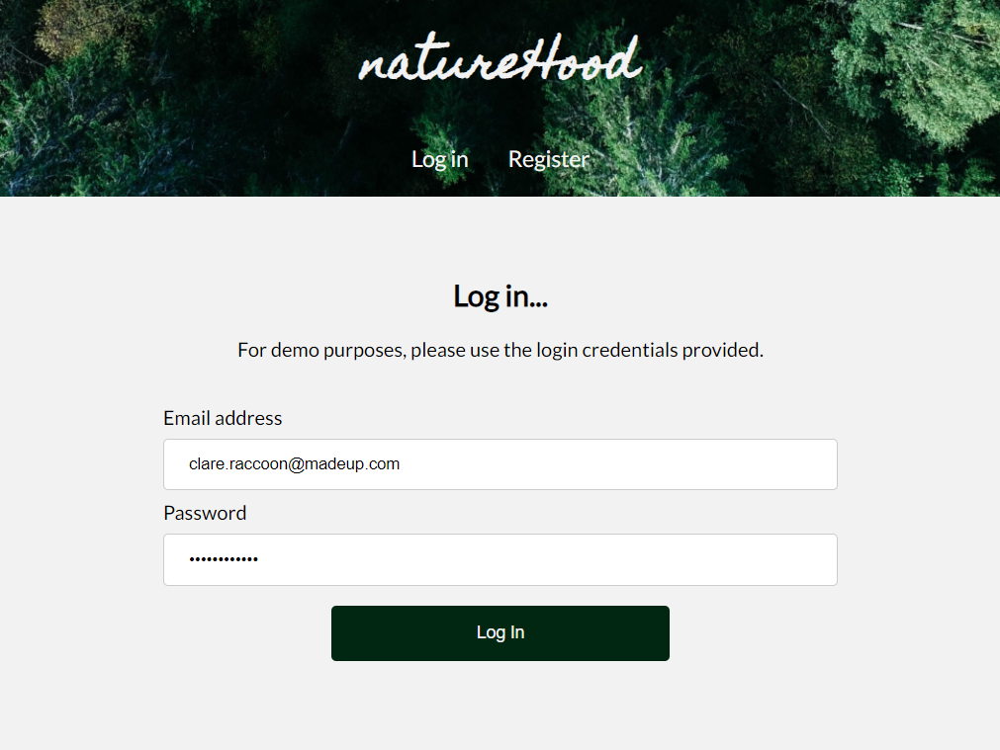
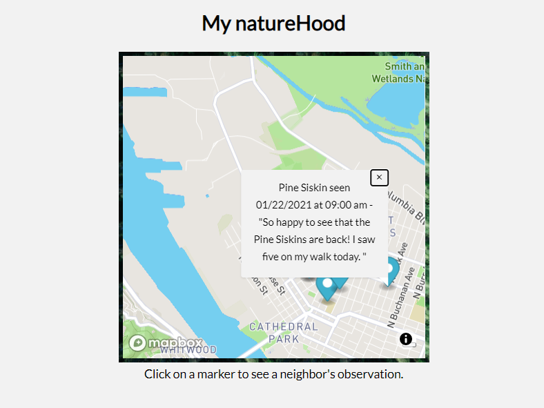
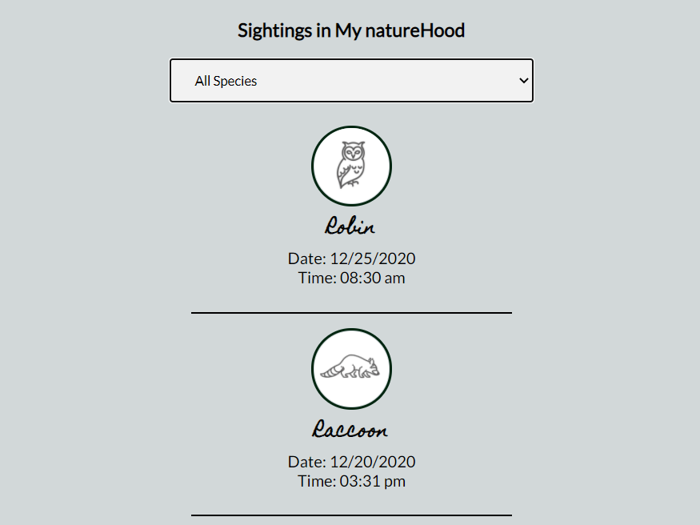
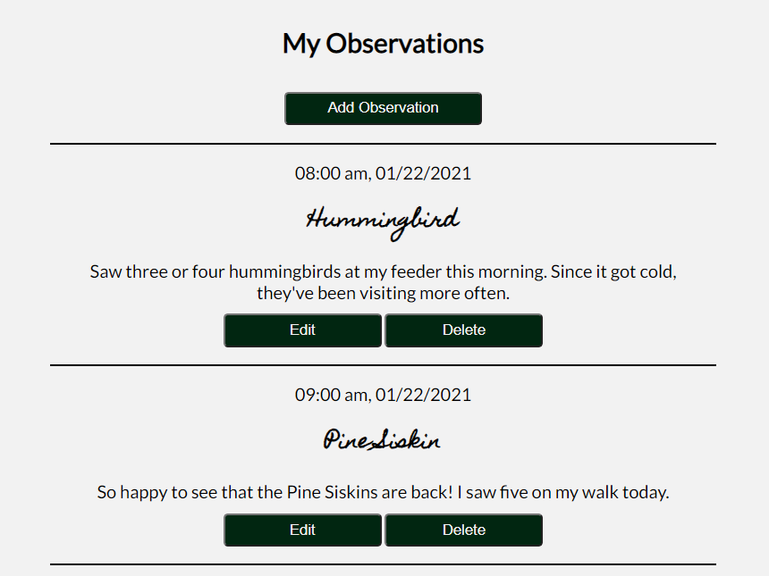
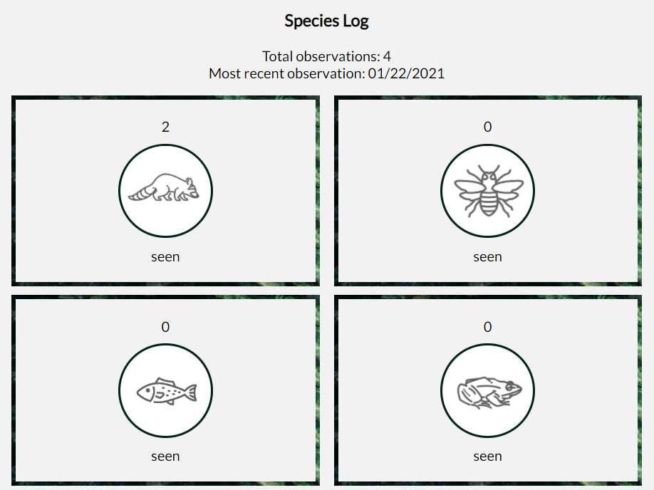
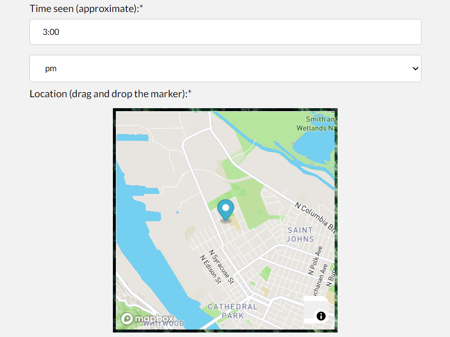

# natureHood

View natureHood [here](https://naturehood-app.vercel.app/).

View the server repo [here](https://github.com/sallygaller/naturehood-api).

natureHood is an app designed to foster community and wildlife advocacy in local neighborhoods. Users can record wildlife observations in their locale (e.g. species, time spotted, approximate location, and photo) and view wildlife spotted by their neighbors. The intention of the app is to build community, provide insight into wildlife population and migratory behaviors, and encourage local conservation efforts.

## How to Use
### Logging In
Users may login with a demo account (using the credentials provided on the Login page), register for their own account, or login with an existing account. 

### My natureHood
My natureHood is the community hub of the application, as it is where the user can see what wildlife has been spotted in their locale by their neighbors. An interactive map is centered on the user's zipcode, and the user can click on the markers to see details about the observations.

Towards the bottom of the page, "Sightings in My natureHood" shows a list of the neighborhood's observations. Observations can be filtered by species type (e.g. mammal, bird, fish).

### My Observations
The "My Observations" page is where the user focuses on their own sightings. The user can add a new observation, and edit or delete an existing observation. 

Towards the bottom of the page, "Species Log" shows a summary of what the user has submitted: how many observations they've recoded, and how many of each species type. 

### Add Observation
The Add Observation form allows the user to log pertinent details about their sighting:
- Species seen
- Species Type (e.g. mammal, bird)
- Description
- Date and time 
- Location 
The user records the location of the sighting by dragging and dropping a marker on an interactive map.

## Technology Used
- HTML
- CSS
- JavaScript
- React
- Jest
- Enzyme
- [Mapbox GL JS v2 0.1](https://docs.mapbox.com/mapbox-gl-js/api/)
- [Google Maps Geocoding](https://developers.google.com/maps/documentation/javascript/examples/geocoding-simple)
